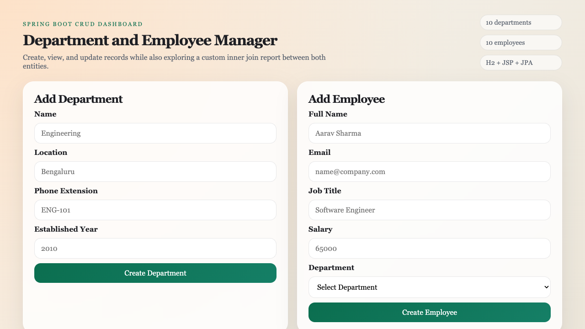
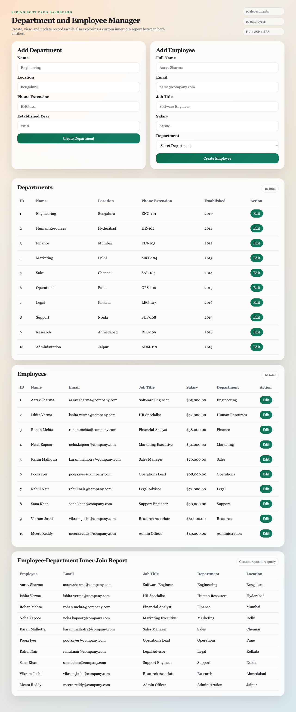

# Spring Boot CRUD Application Report

## Project Overview

This project implements a Spring Boot web application to manage two related entities:

- `Department`
- `Employee`

The application supports the required `create`, `read`, and `update` operations using Spring MVC, Spring Data JPA, JSP, JSTL, and an H2 database.

GitHub repository:

`https://github.com/Raghavendra1729-cell/SGA-2`

## Entity Relationship Design

### Chosen Entities

#### 1. Department

Attributes:

- `id`
- `name`
- `location`
- `phoneExtension`
- `establishedYear`

#### 2. Employee

Attributes:

- `id`
- `fullName`
- `email`
- `jobTitle`
- `salary`
- `department`

### Relationship

- One `Department` can have many `Employee` records.
- One `Employee` belongs to exactly one `Department`.

JPA mapping used:

- `@Entity`
- `@Id`
- `@GeneratedValue`
- `@OneToMany`
- `@ManyToOne`
- `@JoinColumn`

### Relationship Diagram

```text
Department (1) ----------- (Many) Employee
   id                           id
   name                         fullName
   location                     email
   phoneExtension               jobTitle
   establishedYear              salary
                                 department_id
```

## Database Population

The database is created automatically by JPA using:

```properties
spring.jpa.hibernate.ddl-auto=create
```

Sample data is inserted using a `CommandLineRunner` class named `DataInitializer`.

Inserted rows:

- 10 records in `departments`
- 10 records in `employees`

This satisfies the assignment requirement to populate all tables with 10 rows each.

## Implementation Details

### 1. Create Operation

Create functionality is implemented using JSP forms on the dashboard page.

Features:

- A form to add a new `Department`
- A form to add a new `Employee`
- Validation using `jakarta.validation`
- Integrity violation handling for:
  - duplicate department name
  - duplicate employee email

Controller methods used:

- `POST /departments`
- `POST /employees`

Key implementation summary:

- Form data is bound using Spring MVC `@ModelAttribute`
- Validation is handled using `@Valid` and `BindingResult`
- `DataIntegrityViolationException` is wrapped in custom exceptions

Relevant files:

- `src/main/java/com/raghavendra/sga2/controller/DepartmentController.java`
- `src/main/java/com/raghavendra/sga2/controller/EmployeeController.java`
- `src/main/webapp/WEB-INF/jsp/index.jsp`

### 2. Read Operation

Read functionality is implemented on the main dashboard page.

Displayed data:

- list of all departments
- list of all employees
- inner join report showing employee and department details together

Controller method used:

- `GET /`

Custom repository query:

```java
@Query("""
        select new com.raghavendra.sga2.dto.EmployeeDepartmentView(
            e.fullName,
            e.email,
            e.jobTitle,
            d.name,
            d.location
        )
        from Employee e
        inner join e.department d
        order by e.id
        """)
List<EmployeeDepartmentView> fetchEmployeeDepartmentDetails();
```

This fulfills the assignment requirement for a custom query using an inner join between both entities.

Relevant files:

- `src/main/java/com/raghavendra/sga2/repository/EmployeeRepository.java`
- `src/main/java/com/raghavendra/sga2/controller/DashboardController.java`
- `src/main/webapp/WEB-INF/jsp/index.jsp`

### 3. Update Operation

Separate JSP pages are provided for updating both entities.

Update routes:

- `GET /departments/{id}/edit`
- `POST /departments/{id}`
- `GET /employees/{id}/edit`
- `POST /employees/{id}`

Update flow:

1. User opens edit page from the dashboard
2. Existing values are loaded into the form
3. Updated data is submitted
4. The controller sends the data to the service layer
5. The updated entity is saved using JPA

Relevant files:

- `src/main/webapp/WEB-INF/jsp/department-edit.jsp`
- `src/main/webapp/WEB-INF/jsp/employee-edit.jsp`
- `src/main/java/com/raghavendra/sga2/service/DepartmentService.java`
- `src/main/java/com/raghavendra/sga2/service/EmployeeService.java`

## Layer-Wise Design

### Entity Layer

The entity classes define attributes, validation rules, and the relationship between `Department` and `Employee`.

Files:

- `src/main/java/com/raghavendra/sga2/model/Department.java`
- `src/main/java/com/raghavendra/sga2/model/Employee.java`

### Repository Layer

Repository interfaces extend `JpaRepository`.

Files:

- `src/main/java/com/raghavendra/sga2/repository/DepartmentRepository.java`
- `src/main/java/com/raghavendra/sga2/repository/EmployeeRepository.java`

### Service Layer

The service layer contains the main business logic such as:

- fetching entities
- creating records
- updating records
- handling missing data
- handling uniqueness errors

Files:

- `src/main/java/com/raghavendra/sga2/service/DepartmentService.java`
- `src/main/java/com/raghavendra/sga2/service/EmployeeService.java`

### Controller Layer

The controller layer handles web requests and binds data between forms and views.

Files:

- `src/main/java/com/raghavendra/sga2/controller/DashboardController.java`
- `src/main/java/com/raghavendra/sga2/controller/DepartmentController.java`
- `src/main/java/com/raghavendra/sga2/controller/EmployeeController.java`

### View Layer

JSP pages are used for the frontend. JSTL and EL are used to bind model data into the UI.

Files:

- `src/main/webapp/WEB-INF/jsp/index.jsp`
- `src/main/webapp/WEB-INF/jsp/department-edit.jsp`
- `src/main/webapp/WEB-INF/jsp/employee-edit.jsp`
- `src/main/resources/static/css/styles.css`

## Code Snippets

### Entity Mapping Example

```java
@ManyToOne(fetch = FetchType.EAGER, optional = false)
@JoinColumn(name = "department_id", nullable = false)
private Department department;
```

### Create Method Example

```java
public Employee createEmployee(EmployeeForm form) {
    Department department = departmentService.getDepartmentById(form.getDepartmentId());
    Employee employee = new Employee(
            form.getFullName(),
            form.getEmail(),
            form.getJobTitle(),
            form.getSalary(),
            department
    );
    return saveEmployee(employee);
}
```

### Update Method Example

```java
public Department updateDepartment(Long id, DepartmentForm form) {
    Department existingDepartment = getDepartmentById(id);
    existingDepartment.setName(form.getName());
    existingDepartment.setLocation(form.getLocation());
    existingDepartment.setPhoneExtension(form.getPhoneExtension());
    existingDepartment.setEstablishedYear(form.getEstablishedYear());
    return saveDepartment(existingDepartment);
}
```

## Screenshots Section

### 1. Dashboard Page



### 2. Department Update Page


### 3. Employee Update Page


### 4. Full Dashboard with Inner Join Report



## Testing

Unit tests are written for:

- repository custom join query
- department service methods
- employee service methods

Testing tools:

- JUnit 5
- Mockito
- Spring Boot Test

Test classes:

- `src/test/java/com/raghavendra/sga2/repository/EmployeeRepositoryTest.java`
- `src/test/java/com/raghavendra/sga2/service/DepartmentServiceTest.java`
- `src/test/java/com/raghavendra/sga2/service/EmployeeServiceTest.java`

Test command used:

```bash
./mvnw test
```

Result:

- Build completed successfully
- 7 tests passed

## Challenges Faced and Solutions

### 1. JSP integration with Spring Boot

Challenge:

- Spring Boot projects often use Thymeleaf by default, but the assignment required JSP.

Solution:

- Added `tomcat-embed-jasper` and JSTL dependencies.
- Configured Spring MVC view resolver using:

```properties
spring.mvc.view.prefix=/WEB-INF/jsp/
spring.mvc.view.suffix=.jsp
```

### 2. Handling integrity violations

Challenge:

- Duplicate values for unique fields such as department name or employee email can break inserts or updates.

Solution:

- Added unique constraints in the entity classes.
- Caught `DataIntegrityViolationException` in the service layer.
- Converted low-level exceptions into readable custom exceptions.

### 3. Displaying related data cleanly

Challenge:

- The assignment required an inner join between both entities.

Solution:

- Implemented a custom JPQL query in `EmployeeRepository`.
- Returned the result using a DTO named `EmployeeDepartmentView`.

## How to Run the Project

```bash
./mvnw spring-boot:run
```

Open:

- `http://localhost:8080/`
- `http://localhost:8080/h2-console`

H2 console settings:

- JDBC URL: `jdbc:h2:mem:sga2db`
- Username: `sa`
- Password: leave blank

## Conclusion

The application satisfies the assignment requirements by providing:

- two related JPA entities
- database creation and sample data insertion
- create operation through JSP forms
- read operation with list views
- update operation for both entities
- custom inner join query
- service and repository tests
- styled JSP pages

## GitHub URL

`https://github.com/Raghavendra1729-cell/SGA-2`
